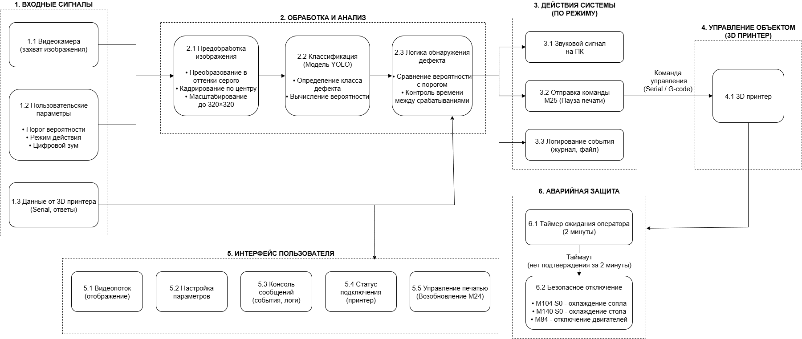
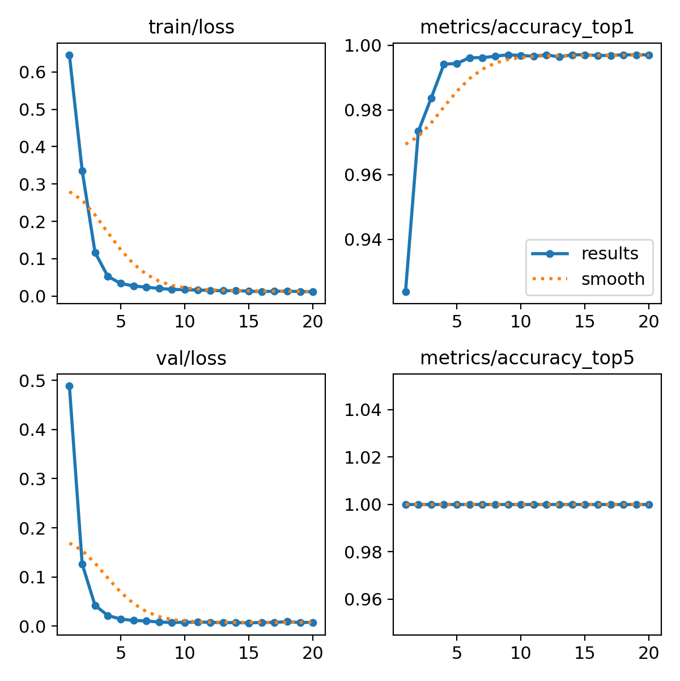
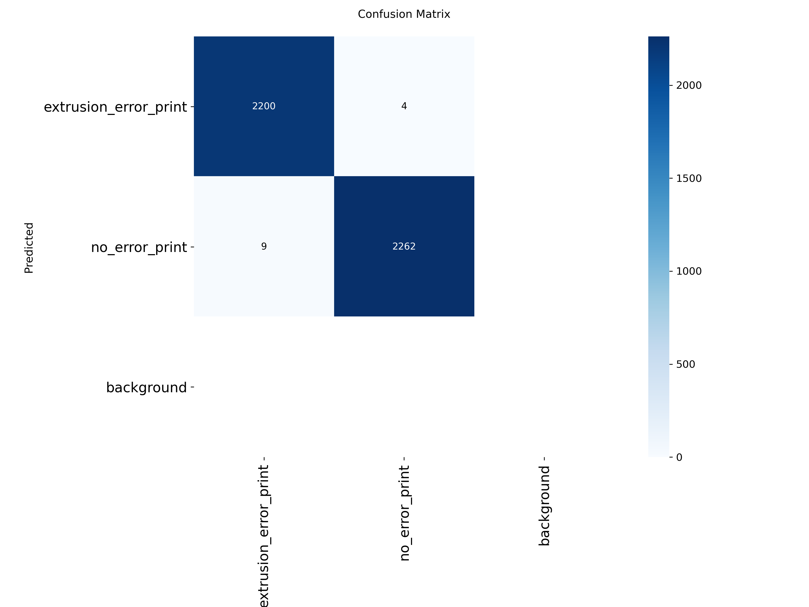
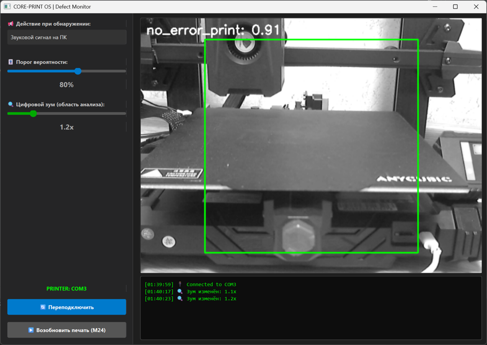

# YOLO-3DPrint-Monitor

---

## 📦 Dataset / Датасет

**🇬🇧 EN:**
The complete dataset (46,664 images) used for training this model is publicly available on Roboflow:
🔗 **[3D Printing Defect Detection Dataset v2](https://app.roboflow.com/alex-lsza3/3dv2/models)**

The dataset includes:
- **Classes:** `no_error_print` (normal printing) and `extrusion_error_print` (extrusion defects)
- **Preprocessing:** Central square crop, grayscale conversion, RGB channel duplication
- **Augmentation:** Rotations ±15°, shifts ±10%, exposure ±5%, noise injection, random crop+scale
- **Split:** 87% Train / 9% Val / 4% Test

**🇷 RU:**
Полный датасет (46 664 изображения), использованный для обучения модели, доступен на Roboflow:
🔗 **[3D Printing Defect Detection Dataset v2](https://app.roboflow.com/alex-lsza3/3dv2/models)**

Датасет включает:
- **Классы:** `no_error_print` (штатная печать) и `extrusion_error_print` (дефекты экструзии)
- **Предобработка:** Центральный квадратный кроп, конвертация в оттенки серого, дублирование в RGB
- **Аугментация:** Повороты ±15°, сдвиги ±10%, экспозиция ±5%, шум, случайный кроп+скейл
- **Разбиение:** 87% Train / 9% Val / 4% Test

---

## 🎥 Live Demo / Демонстрация

  <video src="docs/img/demo.mp4" width="800" controls autoplay loop muted>
    Your browser does not support the video tag.
  </video>
   
  <em>The system detects an extrusion defect in real-time, automatically pauses the printer via M25 G-code, and resumes after operator confirmation (M24).</em>

  <em>Система обнаруживает дефект экструзии в реальном времени, автоматически ставит печать на паузу командой M25 и возобновляет её после подтверждения оператором (M24).</em>

---

## 📌 Abstract / Аннотация

**🇬🇧 EN:**
An autonomous, local Edge AI system for real-time quality control in FDM 3D printing. The system uses a lightweight **YOLOv8n-cls** classifier (2.8M parameters) running entirely on CPU, and establishes a **closed-loop hardware control** via UART/G-code to automatically pause (`M25`) and resume (`M24`) printing upon extrusion defect detection. No cloud, no internet, no subscription.

**🇷🇺 RU:**
Автономная локальная Edge AI-система для контроля качества FDM-печати в реальном времени. Использует лёгкий классификатор **YOLOv8n-cls** (2.8 млн параметров), работающий полностью на CPU, и обеспечивает **замкнутый контур управления** через UART/G-код для автоматической паузы (`M25`) и возобновления (`M24`) печати при обнаружении дефекта экструзии. Без облака, без интернета, без подписки.

---

## 🎯 Motivation / Мотивация

**🇬🇧 EN:**
- The 3D printing market in Russia reached **17.5B RUB in 2023**, growing 19–22% annually.
- **15–30% of long FDM prints** (10–40 hours) end up defective due to thermal fluctuations and filament inconsistencies.
- Existing cloud-based solutions (Obico, OctoPrint plugins) suffer from **network latency (500ms–seconds)**, subscription costs, closed architectures, and lack of direct hardware control.

**🇷🇺 RU:**
- Рынок 3D-печати в России достиг **17.5 млрд руб. в 2023**, рост 19–22% в год.
- **15–30% длительных FDM-печатей** (10–40 часов) заканчиваются браком из-за температурных флуктуаций и неоднородности филамента.
- Существующие облачные решения (Obico, плагины OctoPrint) страдают от **сетевых задержек (500 мс–секунды)**, подписок, закрытой архитектуры и отсутствия прямого управления оборудованием.

---

## 🚀 Key Highlights / Ключевые особенности

| Metric / Метрика | Value / Значение |
|---|---|
| **Classification Accuracy / Точность классификации** | **99.71%** |
| **Defect Precision / Точность обнаружения дефектов** | **99.82%** |
| **End-to-End Latency / Сквозная задержка** | **150–250 ms** |
| **Effective Inference FPS / Частота кадров** | **7.5–8.0 FPS** (raw 14.5-16.0) |
| **CPU Load / Загрузка CPU** | **40–55%** (AMD Ryzen 5 5600U) |
| **RAM Usage / Потребление RAM** | **~300 MB** |
| **Dataset Size / Размер датасета** | **46,664 images** |
| **Model Parameters / Параметры модели** | **2.8M** (YOLOv8n-cls) |
| **Validation Loss / Потери валидации** | **0.00652** (epoch 15) |

---

## 🏗️ System Architecture / Архитектура системы

The system is built on an **event-driven multi-threaded architecture** (PyQt6 + QThread) with three isolated execution flows to ensure UI responsiveness and hardware safety:

**🇬🇧 EN:**
1. **`CameraThread`** — background video capture, preprocessing (central square crop → grayscale → RGB duplication), skipping even frames, and YOLOv8n-cls inference.
2. **`MainWindow`** — GUI rendering, user settings (confidence threshold, digital zoom), event logging, and print state management.
3. **`PrinterSerial`** — async UART polling (100ms interval), G-code command dispatch (`M25`/`M24`), auto-reconnect on USB failure, and buffer management.

**🇷🇺 RU:**
1. **`CameraThread`** — фоновый захват видео, предобработка (центральный квадратный кроп → оттенки серого → дублирование в RGB), пропуск чётных кадров и инференс YOLOv8n-cls.
2. **`MainWindow`** — отрисовка GUI, настройки пользователя (порог уверенности, цифровой зум), логирование событий и управление состоянием печати.
3. **`PrinterSerial`** — асинхронный опрос UART (интервал 100 мс), отправка G-code команд (`M25`/`M24`), автопереподключение при обрыве USB и управление буфером.

  
   
  <em><strong>Figure 1:</strong> Functional block diagram of the closed-loop monitoring system showing data flow from camera capture through YOLOv8 inference to G-code control.</em>

  <em><strong>Рисунок 1:</strong> Функциональная блок-схема системы замкнутого контура, показывающая поток данных от захвата камеры через инференс YOLOv8 до управления G-кодом.</em>

---

## 🧠 Machine Learning Pipeline / Пайплайн машинного обучения

**🇬🇧 EN:**
- **Base Model:** YOLOv8n-cls (transfer learning from ImageNet, 2.8M parameters)
- **Preprocessing:** 
  - Central Square Crop (ensures uniform aspect ratio for different cameras)
  - Grayscale Conversion (prevents false correlations based on filament color)
  - RGB Channel Duplication (maintains compatibility with pre-trained architecture)
- **Augmentation:** Rotations ±15°, shifts ±10%, exposure ±5%, noise injection (0.46%), random crop+scale (up to 10%)
- **Dataset:** 46,664 balanced images (Split: 87% Train / 9% Val / 4% Test)
- **Training:** PyTorch + Ultralytics, batch=512, imgsz=320, 20 epochs, plateau at epoch 10-15
- **Final Metrics:** Val Loss = 0.00652, Train-Val gap < 0.5% (no overfitting)

**🇷🇺 RU:**
- **Базовая модель:** YOLOv8n-cls (трансферное обучение с ImageNet, 2.8 млн параметров)
- **Предобработка:** 
  - Центральный квадратный кроп (обеспечивает единое соотношение сторон для разных камер)
  - Перевод в оттенки серого (исключает ложные корреляции по цвету филамента)
  - Дублирование в RGB (сохраняет совместимость с предобученной архитектурой)
- **Аугментация:** Повороты ±15°, сдвиги ±10%, экспозиция ±5%, шум (0.46%), случайный кроп+скейл (до 10%)
- **Датасет:** 46 664 сбалансированных изображения (Сплит: 87% Train / 9% Val / 4% Test)
- **Обучение:** PyTorch + Ultralytics, batch=512, imgsz=320, 20 эпох, плато на 10-15 эпохе
- **Итоговые метрики:** Val Loss = 0.00652, разрыв Train-Val < 0.5% (нет переобучения)

  
   
  <em><strong>Figure 2:</strong> Training dynamics over 20 epochs: loss convergence (train/val) and accuracy metrics (top-1/top-5). Model reaches plateau at epoch 10 with 99.71% final accuracy.</em>

  <em><strong>Рисунок 2:</strong> Динамика обучения за 20 эпох: сходимость функции потерь (train/val) и метрики точности (top-1/top-5). Модель выходит на плато на 10-й эпохе с итоговой точностью 99.71%.</em>

  
   
  <em><strong>Figure 3:</strong> Confusion matrix on test dataset (1,884 images). True Positives: 941, True Negatives: 938, False Positives: 2, False Negatives: 3. Final Precision: 99.82%, Accuracy: 99.73%.</em>

  <em><strong>Рисунок 3:</strong> Матрица ошибок на тестовой выборке (1,884 изображения). Истинно положительные: 941, истинно отрицательные: 938, ложно положительные: 2, ложно отрицательные: 3. Итоговая точность обнаружения: 99.82%, общая точность: 99.73%.</em>

---

## 🖥️ Graphical User Interface / Графический интерфейс

  
   
  <em><strong>Figure 4:</strong> PyQt6-based graphical interface showing real-time video feed with ROI (green box), confidence threshold slider (80%), digital zoom control (1.2x), printer connection status (COM3), and event console.</em>

  <em><strong>Рисунок 4:</strong> Графический интерфейс на базе PyQt6, показывающий видеопоток в реальном времени с областью интереса (зелёная рамка), ползунок порога уверенности (80%), управление цифровым зумом (1.2x), статус подключения принтера (COM3) и консоль событий.</em>

**🇬🇧 EN:**
The interface features:
- Real-time video stream with overlay (class prediction + confidence score)
- Adjustable confidence threshold (50–100%, default: 80%)
- Digital zoom for ROI selection (adjustable analysis area)
- Action mode selection (PC sound alert, pause print, logging)
- Printer connection status indicator (online/offline with color coding)
- Event console with timestamps and auto-scroll
- Manual resume button (M24 command)

**🇷🇺 RU:**
Интерфейс включает:
- Видеопоток в реальном времени с оверлеем (класс предсказания + уверенность)
- Регулируемый порог уверенности (50–100%, по умолчанию: 80%)
- Цифровой зум для выбора ROI (настраиваемая область анализа)
- Выбор режима реакции (звуковой сигнал, пауза печати, логирование)
- Индикатор статуса подключения принтера (онлайн/офлайн с цветовой кодировкой)
- Консоль событий с временными метками и автопрокруткой
- Кнопка ручного возобновления (команда M24)

---

## 🔌 Hardware Integration & Control / Аппаратная интеграция

**🇬🇧 EN:**
Direct communication with the 3D printer microcontroller (Marlin firmware) via USB/UART (115200 baud) using `pyserial`.

**Key Features:**
- **Safe Pause:** Sends `M25` (Pause SD print) instead of `M112` (Emergency Stop). This saves the current extruder position and keeps the controller active.
- **Resume:** Sends `M24` upon manual operator confirmation via GUI.
- **Auto-Reconnect:** Scans available COM ports using driver detection (CH340, FTDI, CP210x, CDC-ACM).
- **Buffer Management:** Clears input buffer before each command to prevent queue overflow.
- **Fault Tolerance:** Auto-reconnects if USB cable is disconnected or buffer overflows, without crashing the GUI.
- **Polling Interval:** 100ms async timer for non-blocking communication.

**🇷🇺 RU:**
Прямая связь с микроконтроллером 3D-принтера (прошивка Marlin) через USB/UART (115200 бод) с использованием `pyserial`.

**Ключевые особенности:**
- **Безопасная пауза:** Отправляет `M25` (Пауза SD-печати) вместо `M112` (Аварийная остановка). Это сохраняет текущую позицию экструдера и держит контроллер активным.
- **Возобновление:** Отправляет `M24` после ручного подтверждения оператором через GUI.
- **Автопоиск порта:** Сканирует доступные COM-порты с определением драйверов (CH340, FTDI, CP210x, CDC-ACM).
- **Управление буфером:** Очищает входной буфер перед каждой командой для предотвращения переполнения очереди.
- **Отказоустойчивость:** Автоматически переподключается при отключении USB-кабеля или переполнении буфера без падения интерфейса.
- **Интервал опроса:** Асинхронный таймер 100 мс для неблокирующей связи.

---

## 📊 Performance Benchmarks / Производительность

**Tested on:** AMD Ryzen 5 5600U, 32GB RAM, NVIDIA RTX 4060 (GPU used for training only)

| Metric | Value | Requirement | Status |
|---|---|---|---|
| **Inference Time (CPU)** | 45–65 ms | — | ✅ |
| **Inference Time (GPU)** | 12–18 ms | — | ✅ |
| **Effective FPS** | 7.5–8.0 | ≥7 FPS | ✅ |
| **Raw FPS** | 14.5–16.0 | — | ✅ |
| **CPU Load** | 40–55% | ≤60% | ✅ |
| **RAM Usage** | 280–320 MB | ≤2 GB | ✅ |
| **End-to-End Latency** | 150–250 ms | ≤250 ms | ✅ |
| **GUI Response Time** | <50 ms | — | ✅ |

**🇬🇧 EN:**
The system successfully handles hardware failures (USB cable disconnection, buffer overflow) without GUI freezing. Load stabilization is achieved through:
- Skipping even frames (frame_idx % 2 != 0)
- Optimized tensor size (320×320)
- Async QThread architecture
- Verbose output disabled in Ultralytics

**🇷🇺 RU:**
Система успешно обрабатывает аппаратные сбои (отключение USB-кабеля, переполнение буфера) без зависания интерфейса. Стабилизация нагрузки достигается за счёт:
- Пропуска чётных кадров (frame_idx % 2 != 0)
- Оптимизированного размера тензора (320×320)
- Асинхронной архитектуры QThread
- Отключённого verbose вывода в Ultralytics

---

## 💰 Economic Impact / Экономический эффект

**🇬🇧 EN:**
- **Saves per prevented failure:** ~0.3 kg filament (~390 RUB) + electricity
- **Development cost:** 95,672 RUB (~$1,050 USD)
- **Payback period:** 
  - **3–4 months** on a single printer
  - **<1 month** on a fleet of 3–5 units
- **Defect rate reduction:** From 15–30% to <1% for long prints (10–40 hours)

**🇷 RU:**
- **Экономия на каждом предотвращённом браке:** ~0.3 кг филамента (~390 руб.) + электроэнергия
- **Себестоимость разработки:** 95 672 руб. (~$1,050 USD)
- **Срок окупаемости:** 
  - **3–4 месяца** на одном принтере
  - **<1 месяца** на парке из 3–5 устройств
- **Снижение процента брака:** С 15–30% до <1% для длительных печатей (10–40 часов)

---

## 🛠️ Tech Stack / Технологический стек

- **Computer Vision & AI:** PyTorch, Ultralytics YOLOv8, OpenCV
- **Hardware Communication:** PySerial (UART/USB, 115200 baud), G-code (Marlin firmware)
- **UI & Multithreading:** PyQt6, QThread, QTimer (event-driven architecture)
- **Data Augmentation:** Roboflow platform
- **Tested Hardware:** 
  - 3D Printer: Anycubic Kobra 2 Neo (Marlin firmware)
  - Camera: Logitech C310
  - CPU: AMD Ryzen 5 5600U
  - GPU: NVIDIA RTX 4060 (training only)

---

## 📄 Academic Context / Академический контекст

**🇬🇧 EN:**
This project was developed as a **B.Sc. Thesis** at **Saint Petersburg Electrotechnical University "LETI"** (ETI "LETI"), Department of Control Systems and Automation, Faculty of Electronics and Instrument Engineering.

**Details:**
- **Student:** Aleksei Belozor
- **Supervisor:** Dr. Zalina Abdullaeva (PhD, Associate Professor)
- **Consultant:** Mikhail Grechukhin (Senior Lecturer)
- **Year:** 2026
- **Specialty:** 27.03.04 — Control in Technical Systems
- **Profile:** Systems and Technical Means of Automation and Control

📎 [Full Thesis PDF (Russian, 62 pages)](./docs/thesis.pdf)
📎 [Defense Presentation (Russian)](./docs/presentation.pdf)

**🇷🇺 RU:**
Проект выполнен в рамках **выпускной квалификационной работы бакалавра** в **Санкт-Петербургском государственном электротехническом университете «ЛЭТИ»** (ЭТИ «ЛЭТИ»), кафедра систем автоматизации и управления, факультет электроники и приборостроения.

**Детали:**
- **Студент:** Белозор Алексей Александрович
- **Руководитель:** к.т.н., доцент Абдуллаева Залина Мусаевна
- **Консультант:** Гречухин Михаил Николаевич (старший преподаватель)
- **Год:** 2026
- **Направление:** 27.03.04 — Управление в технических системах
- **Профиль:** Системы и технические средства автоматизации и управления

📎 [Полный текст ВКР (62 стр.)](./docs/thesis.pdf)
📎 [Презентация защиты](./docs/presentation.pdf)

---

## 🔮 Future Development / Направления развития

**🇬🇧 EN:**
1. **Multi-camera support** — simultaneous monitoring from multiple angles
2. **Klipper firmware support** — WebSocket integration
3. **Online learning** — model fine-tuning during operation without stopping production
4. **Mobile application** — remote notifications via push messages
5. **Expanded defect classes** — warping, layer shifting, stringing detection
6. **Edge device deployment** — Raspberry Pi, NVIDIA Jetson Nano optimization

**🇷🇺 RU:**
1. **Поддержка нескольких камер** — одновременный мониторинг с разных ракурсов
2. **Поддержка прошивки Klipper** — интеграция через WebSocket
3. **Онлайн-обучение** — дообучение модели во время работы без остановки производства
4. **Мобильное приложение** — удалённые уведомления через push-сообщения
5. **Расширение классов дефектов** — детекция коробления, смещения слоёв, нитей
6. **Развёртывание на Edge-устройствах** — оптимизация для Raspberry Pi, NVIDIA Jetson Nano

---

## 📬 Contact / Контакты

**Aleksei Belozor**
📧 belozor.lesha@mail.ru
🎓 ETI "LETI", Saint Petersburg, Russia
🔗 [GitHub](https://github.com/none-none-n)
🔗 [Roboflow Dataset](https://app.roboflow.com/alex-lsza3/3dv2/models)

---

## 📋 License / Лицензия

This project is licensed under the MIT License — see the [LICENSE](LICENSE) file for details.

---

  <strong>B.Sc. Thesis 2026 | ETI "LETI" | Control Systems and Automation</strong>

